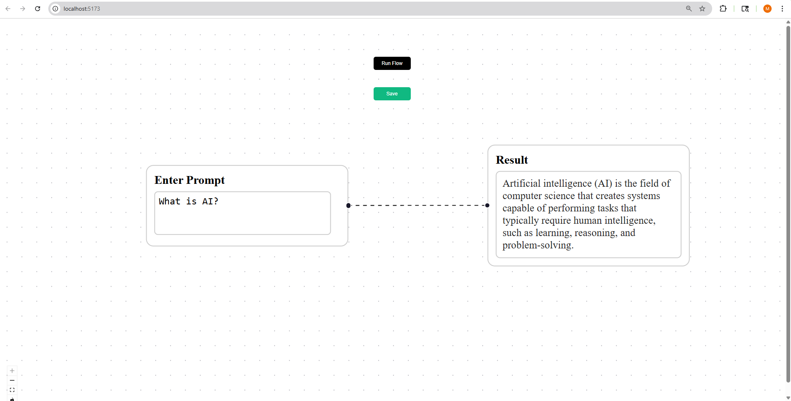

# AI Flow Builder

🔗 Live Demo:https://ai-flow-xi.vercel.app/



A full-stack MERN application where users can enter a prompt, generate an AI response, and visualize the flow using React Flow.

---

## 🚀 Tech Stack

- React (Vite)
- React Flow
- Node.js + Express
- MongoDB
- OpenRouter API

---

## ⚙️ Setup Instructions

### 1. Clone the repo

```bash
git clone https://github.com/mhw3011/ai-flow-builder.git
cd ai-flow-builder
```

---

### 2. Backend Setup

```bash
cd backend
npm install
```

Create a `.env` file inside `backend/`:

```env
OPENROUTER_API_KEY=your_api_key
MONGO_URI=your_mongodb_uri
```

---

## 🔑 Getting API Keys

### OpenRouter API Key

1. Go to https://openrouter.ai/
2. Sign up / log in
3. Go to dashboard → API Keys
4. Create a new key and paste it in `.env`

### MongoDB URI

1. Go to https://www.mongodb.com/cloud/atlas
2. Create a free cluster
3. Click "Connect" → "Drivers"
4. Copy the connection string and replace `<password>`

Run backend:

```bash
node server.js
```

---

### 3. Frontend Setup

```bash
cd frontend
npm install
npm run dev
```

---

## 🧠 Usage

- Enter a prompt in the input node
- Click **Run Flow** to generate AI response
- Click **Save** to store it in MongoDB

---

## 🔐 Note

API keys are stored securely in environment variables and are not exposed to the frontend.
